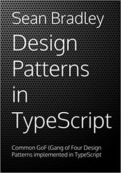

# Design Patterns In TypeScript

This repository focuses on the 23 famous GoF (Gang of Four) Design Patterns implemented in TypeScript.

It is supplementary to my book titled **Design Patterns In TypeScript**



&nbsp;<a href="https://www.amazon.com/dp/B0948BCH24">&nbsp; https://www.amazon.com/dp/B0948BCH24</a><br/>
&nbsp;<a href="https://www.amazon.co.uk/dp/B0948BCH24">&nbsp; https://www.amazon.co.uk/dp/B0948BCH24</a><br/>
&nbsp;<a href="https://www.amazon.in/dp/B094716FD6">&nbsp; https://www.amazon.in/dp/B094716FD6</a><br/>
&nbsp;<a href="https://www.amazon.de/dp/B0948BCH24">&nbsp; https://www.amazon.de/dp/B0948BCH24</a><br/>
&nbsp;<a href="https://www.amazon.fr/dp/B0948BCH24">&nbsp; https://www.amazon.fr/dp/B0948BCH24</a><br/>
&nbsp;<a href="https://www.amazon.es/dp/B0948BCH24">&nbsp; https://www.amazon.es/dp/B0948BCH24</a><br/>
&nbsp;<a href="https://www.amazon.it/dp/B0948BCH24">&nbsp; https://www.amazon.it/dp/B0948BCH24</a><br/>
&nbsp;<a href="https://www.amazon.co.jp/dp/B0948BCH24">&nbsp; https://www.amazon.co.jp/dp/B0948BCH24</a><br/>
&nbsp;<a href="https://www.amazon.ca/dp/B0948BCH24">&nbsp; https://www.amazon.ca/dp/B0948BCH24</a><br/>
&nbsp;<a href="https://www.amazon.com.au/dp/B094716FD6">&nbsp; https://www.amazon.com.au/dp/B094716FD6</a>

(ASIN : B0948BCH24 / B094716FD6)

and courses on [Udemy](https://www.udemy.com/course/design-patterns-typescript/?referralCode=6384C079FB0A503DB9D9) and [YouTube (Channel membership required)](https://www.youtube.com/playlist?list=PLKWUX7aMnlELvv8bXquIgxXYyHH5SFlaP)

<a href="https://www.udemy.com/course/design-patterns-typescript/?referralCode=6384C079FB0A503DB9D9" target="_blank"></a>&nbsp;<a href="https://www.youtube.com/playlist?list=PLKWUX7aMnlEJzRvCXnwFEdk_WJDNjMDOo" target="_blank"></a>

## Course Access

There are 3 possible ways to access the video content in this course,

1. Udemy : [https://www.udemy.com/course/design-patterns-typescript/?referralCode=6384C079FB0A503DB9D9](https://www.udemy.com/course/design-patterns-typescript/?referralCode=6384C079FB0A503DB9D9)
2. YouTube Membership : [https://www.youtube.com/channel/UCmUILI2AWt2MSUgPlZwFdOg/join](https://www.youtube.com/channel/UCmUILI2AWt2MSUgPlZwFdOg/join)
4. Paperback/Kindle : [https://www.amazon.com/dp/B0948BCH24](https://www.amazon.com/dp/B0948BCH24) : (ASIN : B0948BCH24 / B094716FD6)

---
**TIP** 
> [Design Pattern In TypeScript](https://www.amazon.com/dp/B0948BCH24) **(Paperback/Kindle)** includes Video Access Codes to view videos for FREE from the official documentation website at [https://sbcode.net/typescript/](https://sbcode.net/typescript/)

---
**TIP** 
> Get **Udemy Discount Coupons** at [https://sbcode.net/coupons](https://sbcode.net/coupons)

---

**Note**
> If you just want to read my design pattern articles, and you don't need to access the videos, then you can read them via [Medium Membership](https://sean-bradley.medium.com/membership)


## Setup Project

```bash
git clone https://github.com/Sean-Bradley/Design-Patterns-In-TypeScript.git
cd Design-Patterns-In-TypeScript
npm install -g typescript
npm install
tsc -p ./src

# run each pattern tutorial separately, e.g,
node ./dist/factory/factory-concept.js
node ./dist/factory/client.js
```

## Overview

A Design Pattern is a description or template that can be repeatedly applied to a commonly recurring problem in software design.

A familiarity of Design Patterns will be very useful when planning, discussing, managing and documenting your applications from now on and into the future.

Also, throughout the book, as each design pattern is discussed and demonstrated using example code, I also introduce new TypeScript coding concepts with each new design pattern. So that as you progress through the book and try out the examples, you will also get experience and familiarity with some finer details of programming with TypeScript.

So, in the book, you will learn about these 23 Design Patterns, 

* Creational
    - [Factory](src/factory)
    - [Abstract Factory](src/abstract-factory)
    - [Builder](src/builder)
    - [Prototype](src/prototype)
    - [Singleton](src/singleton)
* Structural
    - [Decorator](src/decorator)
    - [Adapter](src/adapter)
    - [Facade](src/facade)
    - [Bridge](src/bridge)
    - [Composite](src/composite)
    - [Flyweight](src/flyweight)
    - [Proxy](src/proxy)
* Behavioral
    - [Command](src/command)
    - [Chain of Responsibility](src/chain-of-responsibility)
    - [Observer Pattern](src/observer)
    - [Interpreter](src/interpreter)
    - [Iterator](src/iterator)
    - [Mediator](src/mediator)
    - [Memento](src/memento)
    - [State](src/state)
    - [Strategy](src/strategy)
    - [Template Method](src/template-method)
    - [Visitor](src/visitor)

## Pattern Types

_... Refer to [Book](https://www.amazon.com/dp/B0948BCH24), pause [Video Lectures](#videos) or subscribe to [Medium Membership](https://sean-bradley.medium.com/membership) to read textual content._

## Class Scope and Object Scope Patterns

_... Refer to [Book](https://www.amazon.com/dp/B0948BCH24), pause [Video Lectures](#videos) or subscribe to [Medium Membership](https://sean-bradley.medium.com/membership) to read textual content._