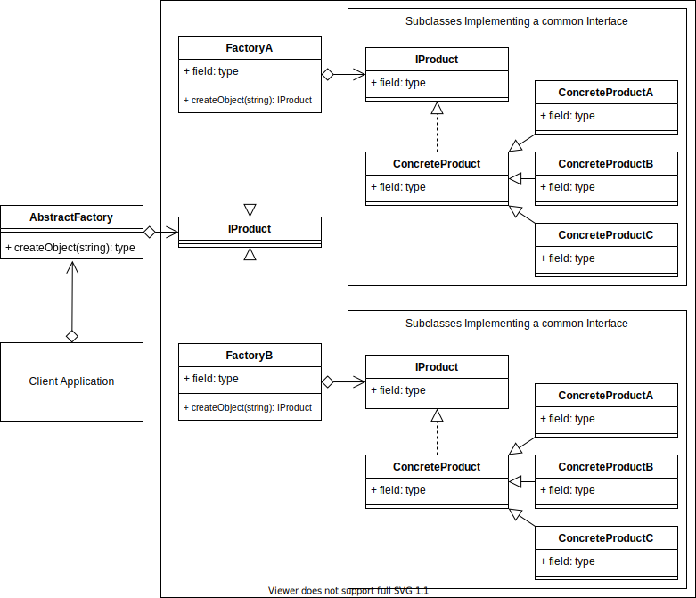

# Abstract Factory Design Pattern

## Videos

| Section                   | Video Links                                                                                                                                                                                                                          |
| ------------------------- | ------------------------------------------------------------------------------------------------------------------------------------------------------------------------------------------------------------------------------------ |
| Abstract Factory Pattern  | <a class="udemyVideoLink" href="https://www.udemy.com/course/design-patterns-typescript/learn/lecture/26664356/?referralCode=6384C079FB0A503DB9D9" target="_blank" title="Abstract Factory"></a>&nbsp;<a id="ytVideoLink" href="https://www.youtube.com/watch?v=fKDZ5QeFVEE&list=PLKWUX7aMnlELvv8bXquIgxXYyHH5SFlaP" target="_blank" title="Abstract Factory Pattern"></a>   |
| Abstract Factory Use Case | <a class="udemyVideoLink" href="https://www.udemy.com/course/design-patterns-typescript/learn/lecture/26664364/?referralCode=6384C079FB0A503DB9D9" target="_blank" title="Abstract Factory Use Case"></a>&nbsp;<a id="ytVideoLink" href="https://www.youtube.com/watch?v=KzDVODMnsh0&list=PLKWUX7aMnlELvv8bXquIgxXYyHH5SFlaP" target="_blank" title="Abstract Factory Use Case"></a> |

## Book 

Cover | Links
-|-
 | &nbsp;<a href="https://www.amazon.com/dp/B0948BCH24">&nbsp; https://www.amazon.com/dp/B0948BCH24</a><br/>&nbsp;<a href="https://www.amazon.co.uk/dp/B0948BCH24">&nbsp; https://www.amazon.co.uk/dp/B0948BCH24</a><br/>&nbsp;<a href="https://www.amazon.in/dp/B094716FD6">&nbsp; https://www.amazon.in/dp/B094716FD6</a><br/>&nbsp;<a href="https://www.amazon.de/dp/B0948BCH24">&nbsp; https://www.amazon.de/dp/B0948BCH24</a><br/>&nbsp;<a href="https://www.amazon.fr/dp/B0948BCH24">&nbsp; https://www.amazon.fr/dp/B0948BCH24</a><br/>&nbsp;<a href="https://www.amazon.es/dp/B0948BCH24">&nbsp; https://www.amazon.es/dp/B0948BCH24</a><br/>&nbsp;<a href="https://www.amazon.it/dp/B0948BCH24">&nbsp; https://www.amazon.it/dp/B0948BCH24</a><br/>&nbsp;<a href="https://www.amazon.co.jp/dp/B0948BCH24">&nbsp; https://www.amazon.co.jp/dp/B0948BCH24</a><br/>&nbsp;<a href="https://www.amazon.ca/dp/B0948BCH24">&nbsp; https://www.amazon.ca/dp/B0948BCH24</a><br/>&nbsp;<a href="https://www.amazon.com.au/dp/B0948BCH24">&nbsp; https://www.amazon.com.au/dp/B0948BCH24</a>

## Overview

_... Refer to [Book](https://www.amazon.com/dp/B0948BCH24), pause [Video Lectures](#videos) or subscribe to [Medium Membership](https://sean-bradley.medium.com/membership) to read textual content._

## Terminology

_... Refer to [Book](https://www.amazon.com/dp/B0948BCH24), pause [Video Lectures](#videos) or subscribe to [Medium Membership](https://sean-bradley.medium.com/membership) to read textual content._

## Abstract Factory UML Diagram



## Output

```bash
node ./dist/abstract-factory/abstract-factory-concept.js
ConcreteProductB { name: 'FactoryA:ConcreteProductB' }
ConcreteProductC { name: 'FactoryB:ConcreteProductC' }
```

## Abstract Factory Example Use Case

_... Refer to [Book](https://www.amazon.com/dp/B0948BCH24), pause [Video Lectures](#videos) or subscribe to [Medium Membership](https://sean-bradley.medium.com/membership) to read textual content._

## Abstract Factory Example UML Diagram

See this UML diagram of an Abstract Furniture Factory implementation that returns chairs
and tables.


## Output

```bash
node ./dist/abstract-factory/client.js
SmallChair
{ width: 40, depth: 40, height: 40 }
MediumTable
{ width: 60, depth: 60, height: 60 }
```

<!-- ## New Coding Concepts

### Arrays

Arrays

Error Handling -->

## Summary

_... Refer to [Book](https://www.amazon.com/dp/B0948BCH24), pause [Video Lectures](#videos) or subscribe to [Medium Membership](https://sean-bradley.medium.com/membership) to read textual content._
