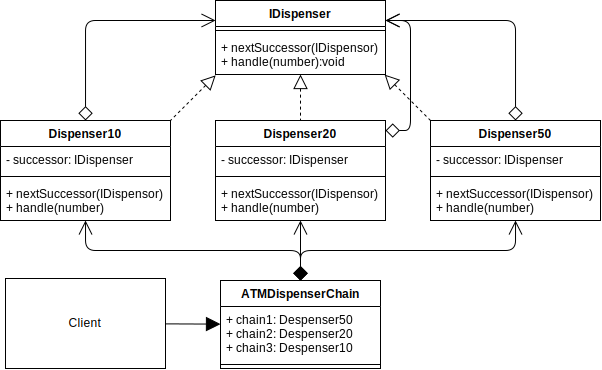

# Chain of Responsibility Design Pattern

## Video Lecture

| Section          | Video Links                                                                                                                                                                                                        |
| ---------------- | ------------------------------------------------------------------------------------------------------------------------------------------------------------------------------------------------------------------ |
| Chain of Responsibility Pattern  | <a class="udemyVideoLink" href="https://www.udemy.com/course/design-patterns-typescript/learn/lecture/26933208/?referralCode=6384C079FB0A503DB9D9" target="_blank" title="Chain of Responsibility"></a>&nbsp;<a id="ytVideoLink" href="https://www.youtube.com/watch?v=bOEyeE3dzPc&list=PLKWUX7aMnlELvv8bXquIgxXYyHH5SFlaP" target="_blank" title="Chain of Responsibility Pattern"></a>   |
| Chain of Responsibility Use Case | <a class="udemyVideoLink" href="https://www.udemy.com/course/design-patterns-typescript/learn/lecture/26933212/?referralCode=6384C079FB0A503DB9D9" target="_blank" title="Chain of Responsibility Use Case"></a>&nbsp;<a id="ytVideoLink" href="https://www.youtube.com/watch?v=AtHTgX6o2z8&list=PLKWUX7aMnlELvv8bXquIgxXYyHH5SFlaP" target="_blank" title="Chain of Responsibility Use Case"></a> |

## Book 

Cover | Links
-|-
 | &nbsp;<a href="https://www.amazon.com/dp/B0948BCH24">&nbsp; https://www.amazon.com/dp/B0948BCH24</a><br/>&nbsp;<a href="https://www.amazon.co.uk/dp/B0948BCH24">&nbsp; https://www.amazon.co.uk/dp/B0948BCH24</a><br/>&nbsp;<a href="https://www.amazon.in/dp/B094716FD6">&nbsp; https://www.amazon.in/dp/B094716FD6</a><br/>&nbsp;<a href="https://www.amazon.de/dp/B0948BCH24">&nbsp; https://www.amazon.de/dp/B0948BCH24</a><br/>&nbsp;<a href="https://www.amazon.fr/dp/B0948BCH24">&nbsp; https://www.amazon.fr/dp/B0948BCH24</a><br/>&nbsp;<a href="https://www.amazon.es/dp/B0948BCH24">&nbsp; https://www.amazon.es/dp/B0948BCH24</a><br/>&nbsp;<a href="https://www.amazon.it/dp/B0948BCH24">&nbsp; https://www.amazon.it/dp/B0948BCH24</a><br/>&nbsp;<a href="https://www.amazon.co.jp/dp/B0948BCH24">&nbsp; https://www.amazon.co.jp/dp/B0948BCH24</a><br/>&nbsp;<a href="https://www.amazon.ca/dp/B0948BCH24">&nbsp; https://www.amazon.ca/dp/B0948BCH24</a><br/>&nbsp;<a href="https://www.amazon.com.au/dp/B0948BCH24">&nbsp; https://www.amazon.com.au/dp/B0948BCH24</a>


## Overview

_... Refer to [Book](https://www.amazon.com/dp/B0948BCH24), pause [Video Lectures](#videos) or subscribe to [Medium Membership](https://sean-bradley.medium.com/membership) to read textual content._

## Terminology

_... Refer to [Book](https://www.amazon.com/dp/B0948BCH24), pause [Video Lectures](#videos) or subscribe to [Medium Membership](https://sean-bradley.medium.com/membership) to read textual content._

## Chain of Responsibility UML Diagram


## Output

```bash
node ./dist/chain-of-responsibility/chain-of-responsibility-concept.js
Successor1 payload = 1
Successor2 payload = -1
Successor2 payload = -0.5
Successor2 payload = -0.25
Successor1 payload = -0.5
Successor1 payload = 0.5
Successor2 payload = -1.5
Finished result = -1.5
```

## Chain of Responsibility Use Case

_... Refer to [Book](https://www.amazon.com/dp/B0948BCH24), pause [Video Lectures](#videos) or subscribe to [Medium Membership](https://sean-bradley.medium.com/membership) to read textual content._

## Example UML Diagram



## Output

```bash
node ./dist/chain-of-responsibility/client.js
Enter amount to withdrawal :
180
Dispensing 3 £50 note
Dispensing 1 £20 note
Dispensing 1 £10 note
Now go spoil yourself
```

## Summary

_... Refer to [Book](https://www.amazon.com/dp/B0948BCH24), pause [Video Lectures](#videos) or subscribe to [Medium Membership](https://sean-bradley.medium.com/membership) to read textual content._
