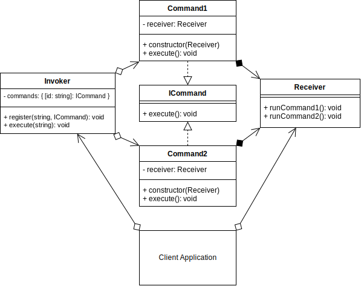
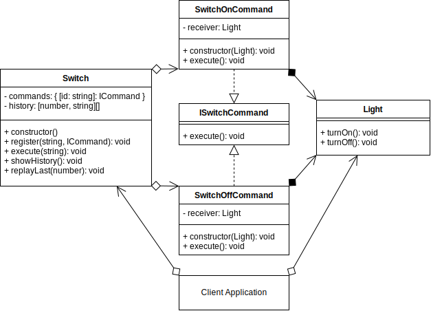

# Command Design Pattern

## Video Lecture

| Section          | Video Links                                                                                                                                                                                                        |
| ---------------- | ------------------------------------------------------------------------------------------------------------------------------------------------------------------------------------------------------------------ |
| Command Pattern  | <a class="udemyVideoLink" href="https://www.udemy.com/course/design-patterns-typescript/learn/lecture/26900644/?referralCode=6384C079FB0A503DB9D9" target="_blank" title="Command"></a>&nbsp;<a id="ytVideoLink" href="https://www.youtube.com/watch?v=tkvpIyuGfdQ&list=PLKWUX7aMnlELvv8bXquIgxXYyHH5SFlaP" target="_blank" title="Command Pattern"></a>   |
| Command Use Case | <a class="udemyVideoLink" href="https://www.udemy.com/course/design-patterns-typescript/learn/lecture/26900646/?referralCode=6384C079FB0A503DB9D9" target="_blank" title="Command Use Case"></a>&nbsp;<a id="ytVideoLink" href="https://www.youtube.com/watch?v=j3I-TZGvUZ4&list=PLKWUX7aMnlELvv8bXquIgxXYyHH5SFlaP" target="_blank" title="Command Use Case"></a> |

## Book 

Cover | Links
-|-
 | &nbsp;<a href="https://www.amazon.com/dp/B0948BCH24">&nbsp; https://www.amazon.com/dp/B0948BCH24</a><br/>&nbsp;<a href="https://www.amazon.co.uk/dp/B0948BCH24">&nbsp; https://www.amazon.co.uk/dp/B0948BCH24</a><br/>&nbsp;<a href="https://www.amazon.in/dp/B094716FD6">&nbsp; https://www.amazon.in/dp/B094716FD6</a><br/>&nbsp;<a href="https://www.amazon.de/dp/B0948BCH24">&nbsp; https://www.amazon.de/dp/B0948BCH24</a><br/>&nbsp;<a href="https://www.amazon.fr/dp/B0948BCH24">&nbsp; https://www.amazon.fr/dp/B0948BCH24</a><br/>&nbsp;<a href="https://www.amazon.es/dp/B0948BCH24">&nbsp; https://www.amazon.es/dp/B0948BCH24</a><br/>&nbsp;<a href="https://www.amazon.it/dp/B0948BCH24">&nbsp; https://www.amazon.it/dp/B0948BCH24</a><br/>&nbsp;<a href="https://www.amazon.co.jp/dp/B0948BCH24">&nbsp; https://www.amazon.co.jp/dp/B0948BCH24</a><br/>&nbsp;<a href="https://www.amazon.ca/dp/B0948BCH24">&nbsp; https://www.amazon.ca/dp/B0948BCH24</a><br/>&nbsp;<a href="https://www.amazon.com.au/dp/B0948BCH24">&nbsp; https://www.amazon.com.au/dp/B0948BCH24</a>

## Overview

_... Refer to [Book](https://www.amazon.com/dp/B0948BCH24), pause [Video Lectures](#videos) or subscribe to [Medium Membership](https://sean-bradley.medium.com/membership) to read textual content._

## Terminology

_... Refer to [Book](https://www.amazon.com/dp/B0948BCH24), pause [Video Lectures](#videos) or subscribe to [Medium Membership](https://sean-bradley.medium.com/membership) to read textual content._

## Command Pattern UML Diagram



## Output

```bash
node ./dist/command/command-concept.js
Executing Command 1
Executing Command 2
Executing Command 1
Executing Command 2
```

## Command Use Case

_... Refer to [Book](https://www.amazon.com/dp/B0948BCH24), pause [Video Lectures](#videos) or subscribe to [Medium Membership](https://sean-bradley.medium.com/membership) to read textual content._

## Example UML Diagram



## Output

```bash
node ./dist/command/client.js
Light turned ON
Light turned OFF
Light turned ON
Light turned OFF
1619288201312 : ON
1619288201313 : OFF
1619288201313 : ON
1619288201313 : OFF
Light turned ON
Light turned OFF
```

<!-- ## New Coding Concepts

### todo -->

## Summary

_... Refer to [Book](https://www.amazon.com/dp/B0948BCH24), pause [Video Lectures](#videos) or subscribe to [Medium Membership](https://sean-bradley.medium.com/membership) to read textual content._
