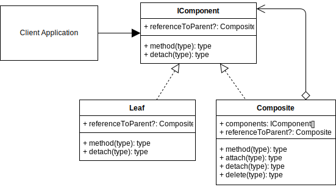
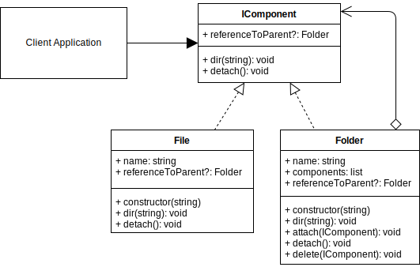

# Composite Design Pattern

## Video Lecture

| Section            | Video Links                                                                                                                                                                                                            |
| ------------------ | ---------------------------------------------------------------------------------------------------------------------------------------------------------------------------------------------------------------------- |
| Composite Pattern  | <a class="udemyVideoLink" href="https://www.udemy.com/course/design-patterns-typescript/learn/lecture/26900630/?referralCode=6384C079FB0A503DB9D9" target="_blank" title="Composite"></a>&nbsp;<a id="ytVideoLink" href="https://www.youtube.com/watch?v=kPBqsQBbRvA&list=PLKWUX7aMnlELvv8bXquIgxXYyHH5SFlaP" target="_blank" title="Composite Pattern"></a>   |
| Composite Use Case | <a class="udemyVideoLink" href="https://www.udemy.com/course/design-patterns-typescript/learn/lecture/26900632/?referralCode=6384C079FB0A503DB9D9" target="_blank" title="Composite Use Case"></a>&nbsp;<a id="ytVideoLink" href="https://www.youtube.com/watch?v=1km6cxawCUg&list=PLKWUX7aMnlELvv8bXquIgxXYyHH5SFlaP" target="_blank" title="Composite Use Case"></a> |

## Book 

Cover | Links
-|-
 | &nbsp;<a href="https://www.amazon.com/dp/B0948BCH24">&nbsp; https://www.amazon.com/dp/B0948BCH24</a><br/>&nbsp;<a href="https://www.amazon.co.uk/dp/B0948BCH24">&nbsp; https://www.amazon.co.uk/dp/B0948BCH24</a><br/>&nbsp;<a href="https://www.amazon.in/dp/B094716FD6">&nbsp; https://www.amazon.in/dp/B094716FD6</a><br/>&nbsp;<a href="https://www.amazon.de/dp/B0948BCH24">&nbsp; https://www.amazon.de/dp/B0948BCH24</a><br/>&nbsp;<a href="https://www.amazon.fr/dp/B0948BCH24">&nbsp; https://www.amazon.fr/dp/B0948BCH24</a><br/>&nbsp;<a href="https://www.amazon.es/dp/B0948BCH24">&nbsp; https://www.amazon.es/dp/B0948BCH24</a><br/>&nbsp;<a href="https://www.amazon.it/dp/B0948BCH24">&nbsp; https://www.amazon.it/dp/B0948BCH24</a><br/>&nbsp;<a href="https://www.amazon.co.jp/dp/B0948BCH24">&nbsp; https://www.amazon.co.jp/dp/B0948BCH24</a><br/>&nbsp;<a href="https://www.amazon.ca/dp/B0948BCH24">&nbsp; https://www.amazon.ca/dp/B0948BCH24</a><br/>&nbsp;<a href="https://www.amazon.com.au/dp/B0948BCH24">&nbsp; https://www.amazon.com.au/dp/B0948BCH24</a>

## Overview

_... Refer to [Book](https://www.amazon.com/dp/B0948BCH24), pause [Video Lectures](#videos) or subscribe to [Medium Membership](https://sean-bradley.medium.com/membership) to read textual content._

## Terminology

_... Refer to [Book](https://www.amazon.com/dp/B0948BCH24), pause [Video Lectures](#videos) or subscribe to [Medium Membership](https://sean-bradley.medium.com/membership) to read textual content._

## Composite UML Diagram



## Output

```bash
node ./dist/composite/composite-concept.js
<Leaf>          name:leaf-b     Parent: none
<Composite>     name:comp-2     Parent: none    Components:2
<Leaf>          name:leaf-a     Parent: comp-2
<Composite>     name:comp-1     Parent: comp-2  Components:0
```

## Composite Use Case

_... Refer to [Book](https://www.amazon.com/dp/B0948BCH24), pause [Video Lectures](#videos) or subscribe to [Medium Membership](https://sean-bradley.medium.com/membership) to read textual content._

## Composite Example UML Diagram



## Output

```bash
node ./dist/composite/client.js
<DIR>  root
..<FILE> abc.txt
..<FILE> 123.txt
..<DIR>  folder_a
....<FILE> xyz.txt
..<DIR>  folder_b
....<FILE> 456.txt

<DIR>  root
..<FILE> abc.txt
..<FILE> 123.txt
..<DIR>  folder_b
....<FILE> 456.txt
....<DIR>  folder_a
......<FILE> xyz.txt
```

<!-- ## New Coding Concepts

### todo -->

## Summary

_... Refer to [Book](https://www.amazon.com/dp/B0948BCH24), pause [Video Lectures](#videos) or subscribe to [Medium Membership](https://sean-bradley.medium.com/membership) to read textual content._
