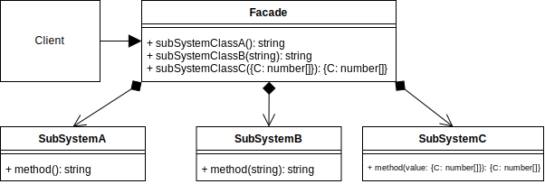

# Facade Design Pattern

## Video Lecture

| Section         | Video Links                                                                                                                                                                                                        |
| --------------- | ------------------------------------------------------------------------------------------------------------------------------------------------------------------------------------------------------------------ |
| Facade Pattern  | <a class="udemyVideoLink" href="https://www.udemy.com/course/design-patterns-typescript/learn/lecture/26817848/?referralCode=6384C079FB0A503DB9D9" target="_blank" title="Facade"></a>&nbsp;<a id="ytVideoLink" href="https://www.youtube.com/watch?v=jhgtdztOoIU&list=PLKWUX7aMnlELvv8bXquIgxXYyHH5SFlaP" target="_blank" title="Facade Pattern"></a>   |
| Facade Use Case | <a class="udemyVideoLink" href="https://www.udemy.com/course/design-patterns-typescript/learn/lecture/26817850/?referralCode=6384C079FB0A503DB9D9" target="_blank" title="Facade Use Case"></a>&nbsp;<a id="ytVideoLink" href="https://www.youtube.com/watch?v=Kqk4R3IfWnY&list=PLKWUX7aMnlELvv8bXquIgxXYyHH5SFlaP" target="_blank" title="Facade Use Case"></a> |

## Book 

Cover | Links
-|-
 | &nbsp;<a href="https://www.amazon.com/dp/B0948BCH24">&nbsp; https://www.amazon.com/dp/B0948BCH24</a><br/>&nbsp;<a href="https://www.amazon.co.uk/dp/B0948BCH24">&nbsp; https://www.amazon.co.uk/dp/B0948BCH24</a><br/>&nbsp;<a href="https://www.amazon.in/dp/B094716FD6">&nbsp; https://www.amazon.in/dp/B094716FD6</a><br/>&nbsp;<a href="https://www.amazon.de/dp/B0948BCH24">&nbsp; https://www.amazon.de/dp/B0948BCH24</a><br/>&nbsp;<a href="https://www.amazon.fr/dp/B0948BCH24">&nbsp; https://www.amazon.fr/dp/B0948BCH24</a><br/>&nbsp;<a href="https://www.amazon.es/dp/B0948BCH24">&nbsp; https://www.amazon.es/dp/B0948BCH24</a><br/>&nbsp;<a href="https://www.amazon.it/dp/B0948BCH24">&nbsp; https://www.amazon.it/dp/B0948BCH24</a><br/>&nbsp;<a href="https://www.amazon.co.jp/dp/B0948BCH24">&nbsp; https://www.amazon.co.jp/dp/B0948BCH24</a><br/>&nbsp;<a href="https://www.amazon.ca/dp/B0948BCH24">&nbsp; https://www.amazon.ca/dp/B0948BCH24</a><br/>&nbsp;<a href="https://www.amazon.com.au/dp/B0948BCH24">&nbsp; https://www.amazon.com.au/dp/B0948BCH24</a>

## Overview

_... Refer to [Book](https://www.amazon.com/dp/B0948BCH24), pause [Video Lectures](#videos) or subscribe to [Medium Membership](https://sean-bradley.medium.com/membership) to read textual content._

## Facade UML Diagram



## Output

```bash
node ./dist/facade/facade-concept.js
A
B
{ C: [ 1, 2, 3 ] }
A
B
{ C: [ 1, 2, 3 ] }
```

## Facade Use Case

_... Refer to [Book](https://www.amazon.com/dp/B0948BCH24), pause [Video Lectures](#videos) or subscribe to [Medium Membership](https://sean-bradley.medium.com/membership) to read textual content._

## Example UML Diagram


## Output

```bash
node ./dist/facade/client.js

---- GameState Snapshot ----
getGameState 59
{ clock: 59, gameOpen: false, entries: [ [ 'sean', 5 ] ] }

---- Reports History ----
0 : 1619260983800 : new user 'sean' created
1 : 1619260983800 : wallet for 'sean' created and set to 0
2 : 1619260983800 : Give new user 'sean' sign up bonus of 10
3 : 1619260983800 : Balance adjustment for 'sean'. New balance = 10
4 : 1619260984312 : Balance check for 'sean' = 10
5 : 1619260984312 : Balance adjustment for 'sean'. New balance = 9
6 : 1619260984312 : New entry '5' submitted by 'sean'

---- User Balance ----
sean : 9

---- GameState Snapshot ----
getGameState 56
{ clock: 56, gameOpen: false, entries: [ [ 'sean', 5 ] ] }
```

<!-- ## New Coding Concepts

### todo -->

unknown v any

## Summary

_... Refer to [Book](https://www.amazon.com/dp/B0948BCH24), pause [Video Lectures](#videos) or subscribe to [Medium Membership](https://sean-bradley.medium.com/membership) to read textual content._
