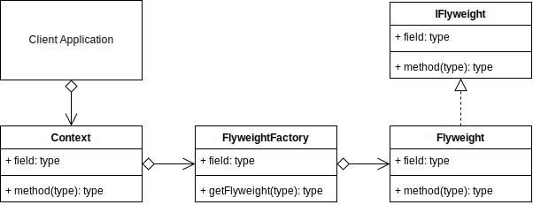
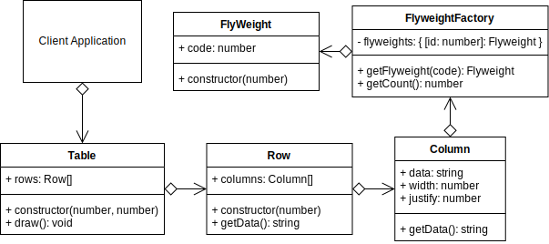

# Flyweight Design Pattern

## Video Lecture

| Section            | Video Links                                                                                                                                                                                                              |
| ------------------ | ------------------------------------------------------------------------------------------------------------------------------------------------------------------------------------------------------------------------ |
| Flyweight Pattern  | <a id="ytVideoLink" href="https://www.youtube.com/watch?v=8y35OCxxFcw&list=PLKWUX7aMnlELvv8bXquIgxXYyHH5SFlaP" target="_blank" title="Flyweight Pattern"></a>   |
| Flyweight Use Case | <a id="ytVideoLink" href="https://www.youtube.com/watch?v=nVBRPGJ8Pak&list=PLKWUX7aMnlELvv8bXquIgxXYyHH5SFlaP" target="_blank" title="Flyweight Use Case"></a> |

## Overview

_...Refer to Book or Videos for extra content._

## Flyweight UML Diagram



## Output

```bash
node ./dist/flyweight/flyweight-concept.js
abracadabra
abracadabra has 11 letters
FlyweightFactory has 5 flyweights
```

## Flyweight Use Case

_...Refer to Book or Videos for extra content._

## Example UML Diagram



## Output

```bash
node ./dist/flyweight/client.js
---------------------------------------
|abra      |     112233    |   cadabra|
|racadab   |     12345     |    332211|
|cadabra   |     445566    |  aa 22 bb|
---------------------------------------
FlyweightFactory has 12 flyweights
```

## Summary

_...Refer to Book or Videos for extra content._
