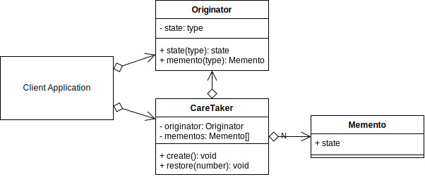
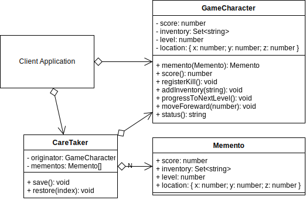

# Memento Design Pattern

## Video Lecture

| Section           | Video Links                                                                                                                                                                                                          |
| ----------------- | -------------------------------------------------------------------------------------------------------------------------------------------------------------------------------------------------------------------- |
| Memento Pattern  | <a class="udemyVideoLink" href="https://www.udemy.com/course/design-patterns-typescript/learn/lecture/27133734/?referralCode=6384C079FB0A503DB9D9" target="_blank" title="Memento"></a>&nbsp;<a id="ytVideoLink" href="https://www.youtube.com/watch?v=A3K_cdkIpmQ&list=PLKWUX7aMnlELvv8bXquIgxXYyHH5SFlaP" target="_blank" title="Memento Pattern"></a>   |
| Memento Use Case | <a class="udemyVideoLink" href="https://www.udemy.com/course/design-patterns-typescript/learn/lecture/27133736/?referralCode=6384C079FB0A503DB9D9" target="_blank" title="Memento Use Case"></a>&nbsp;<a id="ytVideoLink" href="https://www.youtube.com/watch?v=1DGRw1wzM_8&list=PLKWUX7aMnlELvv8bXquIgxXYyHH5SFlaP" target="_blank" title="Memento Use Case"></a> |

## Book 

Cover | Links
-|-
 | &nbsp;<a href="https://www.amazon.com/dp/B0948BCH24">&nbsp; https://www.amazon.com/dp/B0948BCH24</a><br/>&nbsp;<a href="https://www.amazon.co.uk/dp/B0948BCH24">&nbsp; https://www.amazon.co.uk/dp/B0948BCH24</a><br/>&nbsp;<a href="https://www.amazon.in/dp/B094716FD6">&nbsp; https://www.amazon.in/dp/B094716FD6</a><br/>&nbsp;<a href="https://www.amazon.de/dp/B0948BCH24">&nbsp; https://www.amazon.de/dp/B0948BCH24</a><br/>&nbsp;<a href="https://www.amazon.fr/dp/B0948BCH24">&nbsp; https://www.amazon.fr/dp/B0948BCH24</a><br/>&nbsp;<a href="https://www.amazon.es/dp/B0948BCH24">&nbsp; https://www.amazon.es/dp/B0948BCH24</a><br/>&nbsp;<a href="https://www.amazon.it/dp/B0948BCH24">&nbsp; https://www.amazon.it/dp/B0948BCH24</a><br/>&nbsp;<a href="https://www.amazon.co.jp/dp/B0948BCH24">&nbsp; https://www.amazon.co.jp/dp/B0948BCH24</a><br/>&nbsp;<a href="https://www.amazon.ca/dp/B0948BCH24">&nbsp; https://www.amazon.ca/dp/B0948BCH24</a><br/>&nbsp;<a href="https://www.amazon.com.au/dp/B0948BCH24">&nbsp; https://www.amazon.com.au/dp/B0948BCH24</a>

## Overview

_... Refer to [Book](https://www.amazon.com/dp/B0948BCH24), pause [Video Lectures](#videos) or subscribe to [Medium Membership](https://sean-bradley.medium.com/membership) to read textual content._

## Terminology

_... Refer to [Book](https://www.amazon.com/dp/B0948BCH24), pause [Video Lectures](#videos) or subscribe to [Medium Membership](https://sean-bradley.medium.com/membership) to read textual content._

## Memento UML Diagram



### Output

```bash
node ./dist/memento/memento-concept.js
Originator: Set state to 'State #1'
Originator: Set state to 'State #2'
CareTaker: Getting a copy of Originators current state
Originator: Providing Memento of state to caretaker.
Originator: Set state to 'State #3'
CareTaker: Getting a copy of Originators current state
Originator: Providing Memento of state to caretaker.
Originator: Set state to 'State #4'
State #4
CareTaker: Restoring Originators state from Memento
Originator: State after restoring from Memento: 'State #2'
State #2
CareTaker: Restoring Originators state from Memento
Originator: State after restoring from Memento: 'State #3'
State #3
```

## Memento Use Case

_... Refer to [Book](https://www.amazon.com/dp/B0948BCH24), pause [Video Lectures](#videos) or subscribe to [Medium Membership](https://sean-bradley.medium.com/membership) to read textual content._

## Example UML Diagram



## Output

```bash
node ./dist/memento/client.js
Score: 200, Level: 0, Location: {"x":0,"y":0,"z":2}
Inventory: ["sword","rifle"]
CareTaker: Game Save
Score: 500, Level: 1, Location: {"x":0,"y":0,"z":13}
Inventory: ["sword","rifle","motorbike"]
CareTaker: Game Save
Score: 600, Level: 2, Location: {"x":0,"y":0,"z":14}
Inventory: ["sword","rifle","motorbike"]
CareTaker: Restoring Characters attributes from Memento
Score: 200, Level: 0, Location: {"x":0,"y":0,"z":2}
Inventory: ["sword","rifle"]
```

## Summary

_... Refer to [Book](https://www.amazon.com/dp/B0948BCH24), pause [Video Lectures](#videos) or subscribe to [Medium Membership](https://sean-bradley.medium.com/membership) to read textual content._
