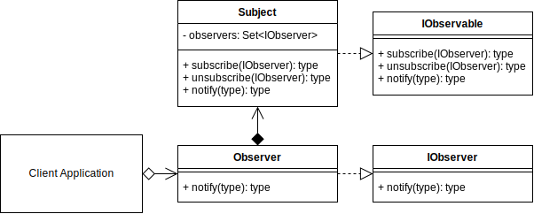
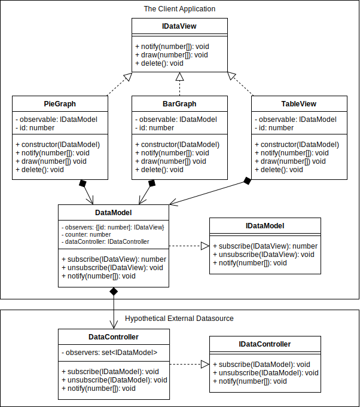

# Observer Pattern

## Video Lecture

| Section           | Video Links                                                                                                                                                                                                          |
| ----------------- | -------------------------------------------------------------------------------------------------------------------------------------------------------------------------------------------------------------------- |
| Observer Pattern  | <a class="udemyVideoLink" href="https://www.udemy.com/course/design-patterns-typescript/learn/lecture/26971678/?referralCode=6384C079FB0A503DB9D9" target="_blank" title="Observer"></a>&nbsp;<a id="ytVideoLink" href="https://www.youtube.com/watch?v=CvahYvzrTW8&list=PLKWUX7aMnlELvv8bXquIgxXYyHH5SFlaP" target="_blank" title="Observer Pattern"></a>   |
| Observer Use Case | <a class="udemyVideoLink" href="https://www.udemy.com/course/design-patterns-typescript/learn/lecture/26971688/?referralCode=6384C079FB0A503DB9D9" target="_blank" title="Observer Use Case"></a>&nbsp;<a id="ytVideoLink" href="https://www.youtube.com/watch?v=gBvaRtwki78&list=PLKWUX7aMnlELvv8bXquIgxXYyHH5SFlaP" target="_blank" title="Observer Use Case"></a> |

## Book 

Cover | Links
-|-
 | &nbsp;<a href="https://www.amazon.com/dp/B0948BCH24">&nbsp; https://www.amazon.com/dp/B0948BCH24</a><br/>&nbsp;<a href="https://www.amazon.co.uk/dp/B0948BCH24">&nbsp; https://www.amazon.co.uk/dp/B0948BCH24</a><br/>&nbsp;<a href="https://www.amazon.in/dp/B094716FD6">&nbsp; https://www.amazon.in/dp/B094716FD6</a><br/>&nbsp;<a href="https://www.amazon.de/dp/B0948BCH24">&nbsp; https://www.amazon.de/dp/B0948BCH24</a><br/>&nbsp;<a href="https://www.amazon.fr/dp/B0948BCH24">&nbsp; https://www.amazon.fr/dp/B0948BCH24</a><br/>&nbsp;<a href="https://www.amazon.es/dp/B0948BCH24">&nbsp; https://www.amazon.es/dp/B0948BCH24</a><br/>&nbsp;<a href="https://www.amazon.it/dp/B0948BCH24">&nbsp; https://www.amazon.it/dp/B0948BCH24</a><br/>&nbsp;<a href="https://www.amazon.co.jp/dp/B0948BCH24">&nbsp; https://www.amazon.co.jp/dp/B0948BCH24</a><br/>&nbsp;<a href="https://www.amazon.ca/dp/B0948BCH24">&nbsp; https://www.amazon.ca/dp/B0948BCH24</a><br/>&nbsp;<a href="https://www.amazon.com.au/dp/B0948BCH24">&nbsp; https://www.amazon.com.au/dp/B0948BCH24</a>

## Overview

_... Refer to [Book](https://www.amazon.com/dp/B0948BCH24), pause [Video Lectures](#videos) or subscribe to [Medium Membership](https://sean-bradley.medium.com/membership) to read textual content._

## Terminology

_... Refer to [Book](https://www.amazon.com/dp/B0948BCH24), pause [Video Lectures](#videos) or subscribe to [Medium Membership](https://sean-bradley.medium.com/membership) to read textual content._

## Observer UML Diagram



## Output

```bash
node ./dist/observer/observer-concept.js
OBSERVER_1 received ["First Notification",[1,2,3]]
OBSERVER_2 received ["First Notification",[1,2,3]]
OBSERVER_1 received ["Second Notification",{"A":1,"B":2,"C":3}]
```

## Observer Use Case

_... Refer to [Book](https://www.amazon.com/dp/B0948BCH24), pause [Video Lectures](#videos) or subscribe to [Medium Membership](https://sean-bradley.medium.com/membership) to read textual content._

## Example UML Diagram



## Output

```bash
node ./dist/observer/client.js
PieGraph, id:1
Drawing a Pie graph using data:1,2,3
BarGraph, id:2
Drawing a Bar graph using data:[1,2,3]
TableView, id:3
Drawing a Table using data:[1,2,3]
PieGraph, id:1
Drawing a Pie graph using data:4,5,6
TableView, id:3
Drawing a Table using data:[4,5,6]
```

<!-- ## New Coding Concepts

### todo

spread operator : problem with using the spread operator in typescript, is that when you indicate the type, eg being number[], you no longer need the spread operator. ESLINT by default will suggest Unexpected any. Specify a different type. So, you might as well just declare your ...x as simply x and not use the spread operator at all. i.e., number[] becomes the same as ... if all your elements are required to be numbers and you can have any amount of number in your array. In the example above, you can remove all the ... and the outputted JS is exactly the same -->

## Summary

_... Refer to [Book](https://www.amazon.com/dp/B0948BCH24), pause [Video Lectures](#videos) or subscribe to [Medium Membership](https://sean-bradley.medium.com/membership) to read textual content._
