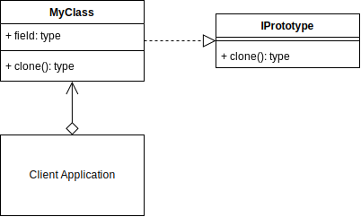
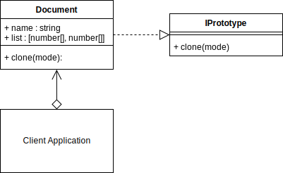

# Prototype Design Pattern

## Video Lecture

| Section            | Video Links                                                                                                                                                                                                            |
| ------------------ | ---------------------------------------------------------------------------------------------------------------------------------------------------------------------------------------------------------------------- |
| Prototype Pattern  | <a class="udemyVideoLink" href="https://www.udemy.com/course/design-patterns-typescript/learn/lecture/26698320/?referralCode=6384C079FB0A503DB9D9" target="_blank" title="Prototype"></a>&nbsp;<a id="ytVideoLink" href="https://www.youtube.com/watch?v=No5akL0cL6I&list=PLKWUX7aMnlELvv8bXquIgxXYyHH5SFlaP" target="_blank" title="Prototype Pattern"></a>   |
| Prototype Use Case | <a class="udemyVideoLink" href="https://www.udemy.com/course/design-patterns-typescript/learn/lecture/26698322/?referralCode=6384C079FB0A503DB9D9" target="_blank" title="Prototype Use Case"></a>&nbsp;<a id="ytVideoLink" href="https://www.youtube.com/watch?v=oQzN6chBOCc&list=PLKWUX7aMnlELvv8bXquIgxXYyHH5SFlaP" target="_blank" title="Prototype Use Case"></a> |

## Book 

Cover | Links
-|-
 | &nbsp;<a href="https://www.amazon.com/dp/B0948BCH24">&nbsp; https://www.amazon.com/dp/B0948BCH24</a><br/>&nbsp;<a href="https://www.amazon.co.uk/dp/B0948BCH24">&nbsp; https://www.amazon.co.uk/dp/B0948BCH24</a><br/>&nbsp;<a href="https://www.amazon.in/dp/B094716FD6">&nbsp; https://www.amazon.in/dp/B094716FD6</a><br/>&nbsp;<a href="https://www.amazon.de/dp/B0948BCH24">&nbsp; https://www.amazon.de/dp/B0948BCH24</a><br/>&nbsp;<a href="https://www.amazon.fr/dp/B0948BCH24">&nbsp; https://www.amazon.fr/dp/B0948BCH24</a><br/>&nbsp;<a href="https://www.amazon.es/dp/B0948BCH24">&nbsp; https://www.amazon.es/dp/B0948BCH24</a><br/>&nbsp;<a href="https://www.amazon.it/dp/B0948BCH24">&nbsp; https://www.amazon.it/dp/B0948BCH24</a><br/>&nbsp;<a href="https://www.amazon.co.jp/dp/B0948BCH24">&nbsp; https://www.amazon.co.jp/dp/B0948BCH24</a><br/>&nbsp;<a href="https://www.amazon.ca/dp/B0948BCH24">&nbsp; https://www.amazon.ca/dp/B0948BCH24</a><br/>&nbsp;<a href="https://www.amazon.com.au/dp/B0948BCH24">&nbsp; https://www.amazon.com.au/dp/B0948BCH24</a>

## Overview

_... Refer to [Book](https://www.amazon.com/dp/B0948BCH24), pause [Video Lectures](#videos) or subscribe to [Medium Membership](https://sean-bradley.medium.com/membership) to read textual content._

## Terminology

_... Refer to [Book](https://www.amazon.com/dp/B0948BCH24), pause [Video Lectures](#videos) or subscribe to [Medium Membership](https://sean-bradley.medium.com/membership) to read textual content._

## Prototype UML Diagram



## Output

When using the shallow copy approach. Changing the inner item of OBJECT2s array, also affected OBJECT1s array.

```bash
node ./dist/prototype/prototype-concept.js
OBJECT1: {"field":[1,2,3,4]}
OBJECT2: {"field":[1,2,3,4]}
OBJECT2: {"field":[1,101,3,4]}
OBJECT1: {"field":[1,101,3,4]}
```

When using the deep copy approach. Changing the inner item of OBJECT2s array, does not affect OBJECT1s array.

```powershell
node ./dist/prototype/prototype-concept.js
OBJECT1: {"field":[1,2,3,4]}
OBJECT2: {"field":[1,2,3,4]}
OBJECT2: {"field":[1,101,3,4]}
OBJECT1: {"field":[1,2,3,4]}
```

## Prototype Use Case

_... Refer to [Book](https://www.amazon.com/dp/B0948BCH24), pause [Video Lectures](#videos) or subscribe to [Medium Membership](https://sean-bradley.medium.com/membership) to read textual content._

## Example UML Diagram



## Output

```bash
node ./dist/prototype/client.js
Document {
  name: 'Original',
  array: [ [ 1, 2, 3, 4 ], [ 5, 6, 7, 8 ] ]
}

Document {
  name: 'Copy 1',
  array: [ [ 1, 2, 3, 4 ], [ 5, 6, 200, 8 ] ]
}
Document {
  name: 'Original',
  array: [ [ 1, 2, 3, 4 ], [ 5, 6, 200, 8 ] ]
}

Document {
  name: 'Copy 2',
  array: [ [ 1, 2, 3, 4 ], [ 9, 10, 11, 12 ] ]
}
Document {
  name: 'Original',
  array: [ [ 1, 2, 3, 4 ], [ 5, 6, 200, 8 ] ]
}

Document {
  name: 'Copy 3',
  array: [ [ 1, 2, 3, 4 ], [ 1234, 6, 200, 8 ] ]
}
Document {
  name: 'Original',
  array: [ [ 1, 2, 3, 4 ], [ 5, 6, 200, 8 ] ]
}
```

<!-- ## New Coding Concepts

### todo

JSON.parse JSON.stringify

Object.assign -->

## Summary

_... Refer to [Book](https://www.amazon.com/dp/B0948BCH24), pause [Video Lectures](#videos) or subscribe to [Medium Membership](https://sean-bradley.medium.com/membership) to read textual content._
