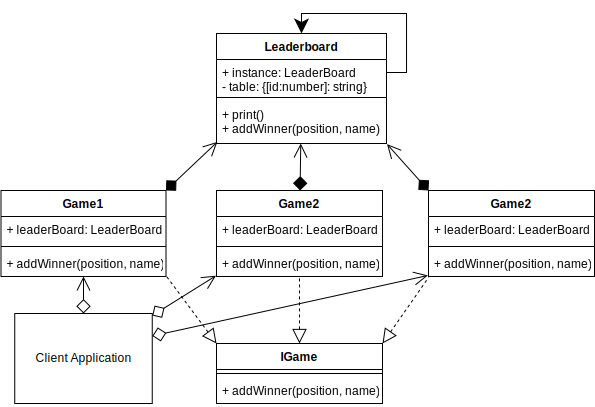

# Singleton Design Pattern

## Video Lecture

| Section            | Video Links                                                                                                                                                                                                              |
| ------------------ | ------------------------------------------------------------------------------------------------------------------------------------------------------------------------------------------------------------------------ |
| Singleton Pattern  | <a id="ytVideoLink" href="https://www.youtube.com/watch?v=yg3gt-SZGQY&list=PLKWUX7aMnlELvv8bXquIgxXYyHH5SFlaP" target="_blank" title="Singleton Pattern"></a>   |
| Singleton Use Case | <a id="ytVideoLink" href="https://www.youtube.com/watch?v=7LPLT2vgUJk&list=PLKWUX7aMnlELvv8bXquIgxXYyHH5SFlaP" target="_blank" title="Singleton Use Case"></a> |

## Overview

_...Refer to Book or Videos for extra content._

## Singleton UML Diagram


## Output

```bash
node ./dist/singleton/singleton-concept.js
true
```

## Singleton Use Case

_...Refer to Book or Videos for extra content._

## Example UML Diagram



## Output

```bash
node ./dist/singleton/client
-----------Leaderboard-----------
|       1       |       Emmy    |
|       2       |       Cosmo   |
|       3       |       Sean    |

-----------Leaderboard-----------
|       1       |       Emmy    |
|       2       |       Cosmo   |
|       3       |       Sean    |

-----------Leaderboard-----------
|       1       |       Emmy    |
|       2       |       Cosmo   |
|       3       |       Sean    |
```

<!-- ## New Coding Concepts

### todo -->

## Summary

_...Refer to Book or Videos for extra content._
